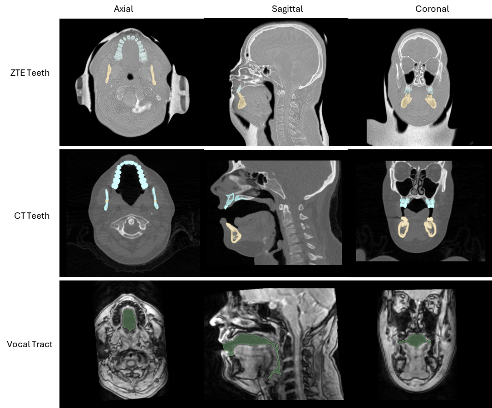
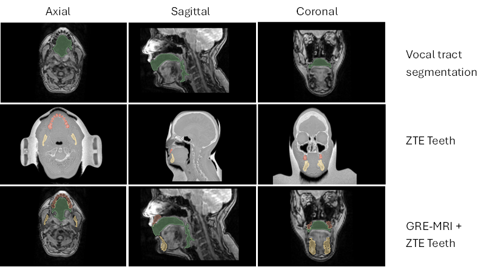
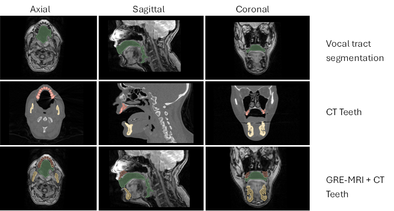
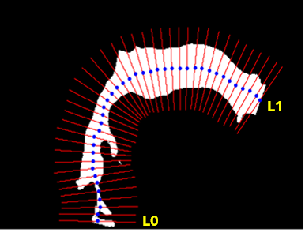

# MRI_Vocal_Tract_Models

To evaluate zero echo time (ZTE) MRI as a radiation-free method for imaging dental and mandibular structures relevant to vocal tract modeling, and to assess the geometric and acoustic consequences of incorporating ZTE-derived teeth into MRI-based vocal tract models.

## Repository Structure

MRI_Vocal_Tract_Models/   
│  
├── matlab_functions/  
│   Collection of helper MATLAB functions used throughout the workflow.  
│  
├── acoustic_analysis_final.m  
│   MATLAB script used to compute acoustic properties of the vocal tract models.  
│  
├── zte_post_processing_final.m  
│   MATLAB script for post-processing raw ZTE MRI data. Includes histogram-based bias correction and manual seed picking of false air intensities.  
│  
├── VAF_Final.ipynb  
│   Jupyter notebook used for computing Vocal Tract Area Functions (VAF).  
│  
└── README.md  
    Documentation describing the repository structure and workflow.

## Workflow Summary

### 1. ZTE Post Processing

Run `zte_post_processing_final.m` for enhanced visualization of dental structures. The code applies an iterative histogram-based log-domain bias correction and normalization procedure based on (Wiesinger F et al 2019).

### 2. Registration and Upsampling

3D Slicer is used to register post-processed ZTE-MRI and GRE-MRI to their CT counterparts. Landmarks included: the tip of the epiglottis, the posterior boundary of the nasal concha, the inferior border of the mandibular body, the anterior maxillary dentition, the body of the hyoid bone, the anterior tubercle of the atlas (C1 vertebra), the inferior medial border of the axis body (C2 vertebra), and the intersection of the external occipital crest with the foramen magnum.  

The volumes are upsampled to match CT dimensions and pixel spacing.

### 3. Segmentation

The vocal tract is segmented from registered and upsampled GRE-MRI. Teeth are respectively segmented from post-processed, registered, and upsampled ZTE-MRI and CT.

  

### 4. Create Hybrid Models

Teeth from CT and ZTE-MRI are aligned to GRE-MRI using 3D Slicer's transform module to create hybrid vocal tract models.

  
  

### 5. Vocal Tract Area Function (VAF) Calculation

Use `VAF_Final.ipynb` to compute cross-sectional area along the vocal tract. For each model, a fixed 40-point airway centerline was defined along the midsagittal plane, extending from just superior to the glottis (L0) to the lips (L1). At each centerline location, an oblique cross-sectional plane orthogonal to the local airway direction was computed, and the enclosed cross-sectional area in the yz plane was measured.

  

### 6. Acoustic Analysis

Run `acoustic_analysis_final.m` to analyze the acoustic consequences of incorporating ZTE-derived teeth and CT-derived teeth into the vocal tract model. These calculations were performed in the frequency domain with a lossy transmission line model based on (Sondhi and Schroeter, 1987) but specifically as described in Story et al. (2000) and Story and Bunton (2017).

## Requirements

### Software

MATLAB 2024b  
Python

### Suggested Python Packages

numpy, pandas, matplotlib, pillow, pynrrd, scipy, scikit-image

## References
1. Wiesinger F, Sacolick LI, Menini A, Kaushik SS, Ahn S, Veit-Haibach P, Delso G, Shanbhag DD. Zero TE MR bone imaging in the head. Magn Reson Med. 2016 Jan;75(1):107-14. Lu A, Gorny KR, Ho ML. Zero TE MRI for Craniofacial Bone Imaging. AJNR Am J Neuroradiol. 2019 Sep;40(9):1562-1566.

2. Sondhi, M.M., Schroeter, J., 1987. A hybrid time-frequency domain articulatory speech synthesizer. IEEE Trans. ASSP ASSP-35 (7), 955–967. doi: 10.1109/tassp. 1987.1165240 .

3. Story, B.H., Laukkanen, A-M., and Titze, I.R., (2000). Acoustic impedance of an artificially lengthened and constricted vocal tract, J. Voice, 14(4), 455-469. 

4. Story, B. H., & Bunton, K. (2017). An acoustically-driven vocal tract model for stop consonant production. Speech communication, 87, 1-17. DOI: 10.1016/j.specom.2016.12.001. 

